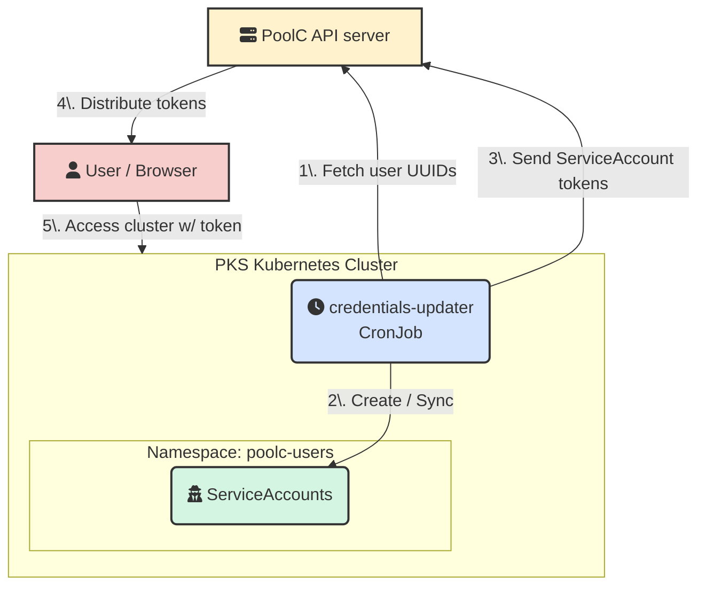

# PKS Credentials Updater

PKS (Poolc Kubernetes Service) 클러스터의 유저 정보를 일정 주기로 PoolC API 서버와 동기화하는 어플리케이션입니다.

연세대학교 공과대학 프로그래밍 동아리 풀씨는 매 학기마다 새 동아리원을 뽑습니다. 따라서 최소한 한 학기 주기로 탈퇴한 회원의 클러스터
접근을 제한하고, 새 회원의 클러스터 접근을 허용하는 작업이 필요합니다. PKS Credentials Updater는 이를 자동화하여 클러스터
운영 비용을 줄이기 위해 개발되었습니다.

## Overall Architecture



## Prerequisites

PKS Credential Updater를 배포하기 이전에, 아래 요구사항을 먼저 만족해야 합니다:

- `poolc-system` Namespace가 PKS 클러스터에 존재해야 합니다.
- 모든 사용자 ServiceAccount를 포함하는 Group(기본값: `system:serviceaccounts:poolc-users`)이 존재해야 합니다.
- 해당 Group에 대응되는 제한적인 ClusterRole과 ClusterRoleBinding이 존재해야 합니다.
- 해당 Group에 대응되는 제한적인 kyverno ClusterPolicy가 존재해야 합니다.

## Configuration

### Schedule

PKS Credentials Updater는 Kubernetes [CronJob](https://kubernetes.io/docs/concepts/workloads/controllers/cron-jobs/)
으로 배포됩니다. 해당 CronJob은 KST 기준 매주 월요일 00시 00분에 실행됩니다. 이 주기를 변경하기 위해서는, `manifests/cronjob.yaml`의
`schedule` 값을 수정해야 합니다:

> [!IMPORTANT]
> 해당 주기를 늘리는 경우, ServiceAccount Token의 expiration time도 함께 늘려야 합니다. 그렇지 않을 경우, rotation이
> 발생하기 이전에 ServiceAccount Token이 먼저 만료되어 동아리원들의 클러스터 접근이 제한될 수 있습니다.
> 
> PKS credentials updater에서 expiration time을 늘리는 것과는 별개로, ServiceAccount Token의 가능한 최대 expiration
> time은 kube-apiserver의 `--service-account-max-token-expiration` 값으로 정해져 있습니다.
> [현재 설정값](https://github.com/PoolC/pks-bootstrapping/blob/main/unmanaged/kubeadm-config-n3.yaml)은 7일입니다.

```yaml
spec:
  schedule: "0 15 * * 0" # 기본값
```

## Running the Job Immediately

기본적으로 CronJob은 일정 주기에 따라 특정 시점에만 실행되기 때문에, 클러스터에 배포한다고 곧바로 실행되지 않습니다. 이를 수동으로
실행하기 위해서는, 아래 명령어를 통해 CronJob의 `jobTemplate`으로부터 Job을 직접 생성해야 합니다.

```bash
kubectl create job \
    -n poolc-system \
    --from=cronjob/credentials-updater \
    "credentials-updater-manual-$(TZ='Etc/UTC' date +'%Y%m%d%H%M%S')"
```

## Possible Improvements

1. PKS Credentials Updater의 CronJob은 기본 주기가 7일로 설정되어 있습니다. CronJob controller가 Job을 잘 생성하는지
   테스트하기 위해 수일을 기다릴 수는 없는 노릇이므로, test/production 환경의 분리를 고려해볼 수 있습니다.
   Argo CD는 [Kustomize](https://kubernetes.io/docs/tasks/manage-kubernetes-objects/kustomization/)와
   [Helm](https://helm.sh/)을 통한 배포도 지원하므로,
   이를 [ApplicationSet](https://argo-cd.readthedocs.io/en/stable/user-guide/application-set/)과 결합해
   production 환경과 test 환경을 분리할 수 있습니다.

## License

MIT License
